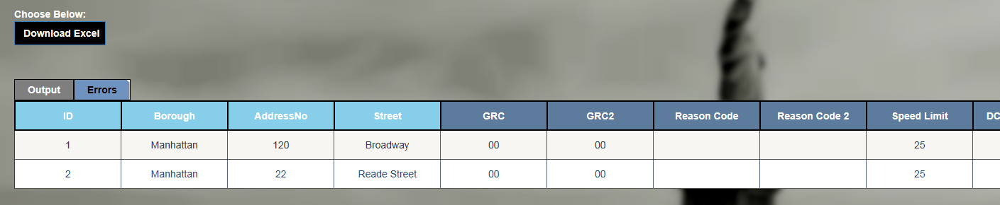
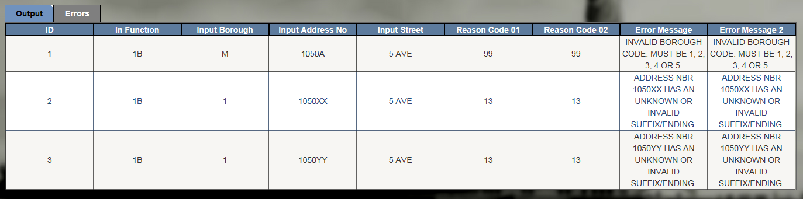

<h2>WebGBAT</h2>
<h2>User Guide</h2>

<h3>1. What is WebGBAT and what does it do?</h3>

WebGBAT allows users to upload an Excel spreadsheet with New York City geographic location information, such as an address, intersection, street segment, street stretch, block and lot or BIN.  Users may then select a Function in order to obtain related geographic and property information, such as cross streets, side of street, tax block and lot, five-digit ZIP code, census tract and block, police precinct, community district, city council district, etc.

<h3>2. WebGBAT consists of four pages:</h3>

The following is an overview of the four pages.  Detail will appear later in this document.

<h3>Note: To return to the Home Page</h3> 
at any point, click on the red ’WebGBAT’ (see image below) in the upper left hand corner of any WebGBAT screen.

<h3>a.  Homepage – Welcome, Choose a Function, Upload a File</h3>

This page allows the user to select a function, and upload an Excel spreadsheet which contains input fields that are appropriate for the function that was selected.

•     Step 1: Click a radio button to choose the function.

•     Step 2: Press ‘Browse’ to find and select the Excel spreadsheet.  Double click (or press ‘Open’) on the ‘Choose File to Upload’ screen. 

•     Step 3: Press ‘Next’ to continue.

A sample Homepage appears below.

<h3>b.  Page 2 – GridView Select Page</h3>

This page allows users to see their inputs uploaded to a GridView where the users can edit and update the input data.
The users are also tasked with identifying the input columns by selecting the appropriate input field name from the drop down lists available above each column.  For example, for Function 1B user selects the Borough (or Zip Code), Address No, and Street Name.

<h3>Note 1: The first row of every input Excel spreadsheet must be a header row.</h3> 
In any case, WebGBAT ignores the first row of the input spreadsheet.  The contents of the first row do appear on the GridView page but they are not processed by WebGBAT.

<h3>Note 2: Freeform Street names .</h3> 
are not supported in this release of WebGBAT.  They will be supported in a future release.

This is the page prior to choosing the field description

Below is a snapshot of a sample page after choosing the WebGBAT input field headings.

Note that the WebGBAT headings (which are highlighted in yellow for the document) appear above the user’s headings (from row 1 of the input Excel spreadsheet).

<h3>c.  Page 3 – Output Selection</h3>

This page allows users to select the output fields they wish to appear in the output Grid View and output spreadsheet. For example, for Function 1B users have the ability to select all output fields, or some fields, depending on their preferences such as only Geographic Information, or Property level Information, or individual fields within any of those groups.

Users control this using the arrows between the list of available fields (on the left-hand side of the screen) and the list of selected output fields (on the right-hand side of the screen) 

A sample portion of the Page 3 – Output Select Page appears below:

Initial display – top portion of page

After some selections are made – the top portion of the page appears as follows:

Note: After scrolling down, ‘Submit’ will appear at the bottom of the page.

<h3>d.  Page 4 – Results Page</h3>

WebGBAT returns all successful geocoded results & errors to users to review.  

The user may also download/export the results to an Excel workbook by clicking on ‘Download Excel Workbook’. 

WebGBAT first shows the successful ‘Output’.

See below.

To see the errors, the user clicks on ‘Errors’.

See sample errors below.

